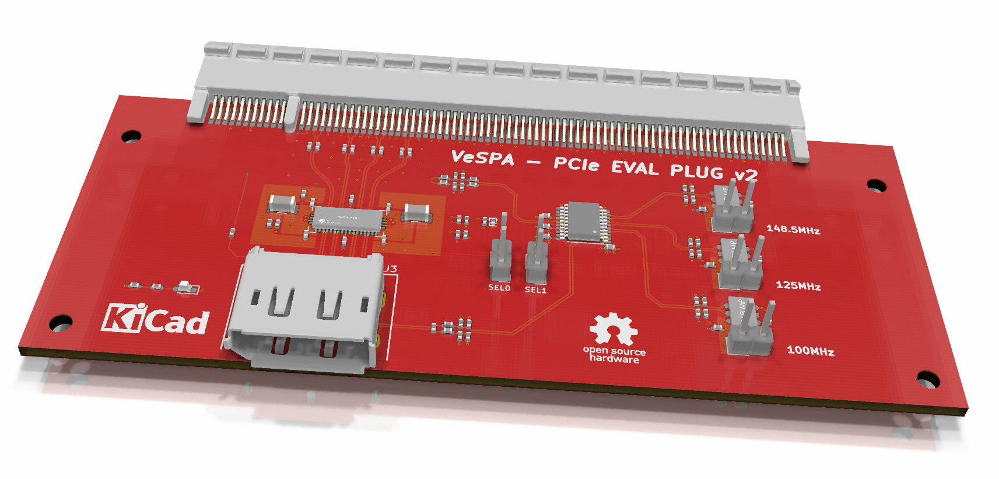

# PCIe analyzer - Eval board adapter

Board design files of the VeSPA PCIe eval board adapter

	Note: This design was performed in KiCad nightly , you will need a Nightly build to open and edit these source files.

# Status

This version has not been fully tested yet.

# What it is

This board can connect the VeSPA PCIe interposer to any evaluation board with a PCIe connector.
